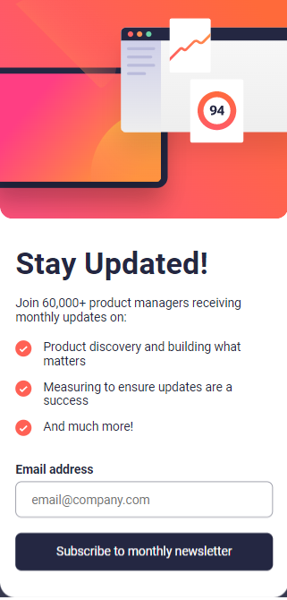

# Frontend Mentor - Newsletter sign-up form with success message solution

This is a solution to the [Newsletter sign-up form with success message challenge on Frontend Mentor](https://www.frontendmentor.io/challenges/newsletter-signup-form-with-success-message-3FC1AZbNrv). Frontend Mentor challenges help you improve your coding skills by building realistic projects. 

### Features

Users should be able to:

- Add their email and submit the form
- See a success message with their email after successfully submitting the form
- See form validation messages if:
  - The field is left empty
  - The email address is not formatted correctly
- View the optimal layout for the interface depending on their device's screen size
- See hover and focus states for all interactive elements on the page

### Screenshot

### Links

- Solution URL: https://github.com/Jorge-PMarin/newsletter-sign-up-with-success-message-FM
- Live Site URL: https://jorge-pmarin.github.io/newsletter-sign-up-with-success-message-FM/

### Built with

- Semantic HTML5 markup
- SASS - SCSS
- Flexbox
- Mobile-first workflow
- BEM